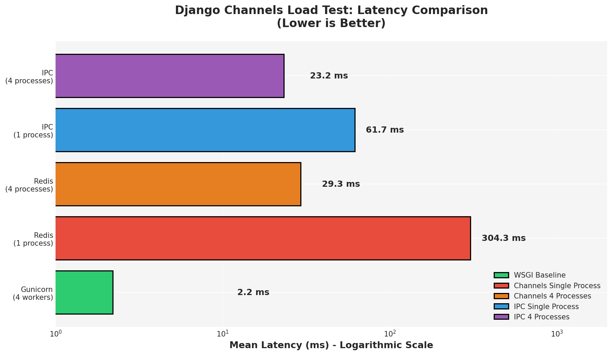
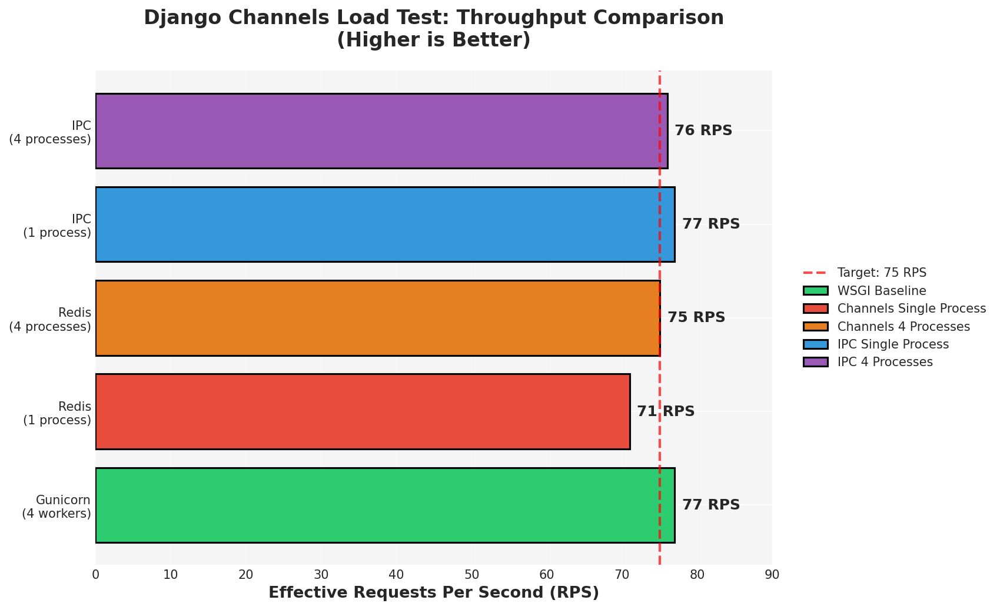

Load Testing Results - 2025-11-29
==================================

Overview
--------

These load tests compare Django Channels 4.3.2 (ASGI) HTTP performance against 
traditional WSGI (Gunicorn 23.0.0) under sustained load.

**Scope:** These tests evaluate HTTP request handling only. Channels is primarily 
designed for WebSocket and async workflows, not raw HTTP throughput optimization.

Test Environment
----------------

**Hardware**

- OS: Windows 11 Home Single Language (64-bit) running WSL2
- WSL2 version: 2.6.1.0
- Kernel: 6.6.87.2-1
- CPU: 4 cores
- RAM: 7.88 GB total

**Software**

- Python: 3.12.3
- Django: 5.2.8
- Channels: 4.3.2
- Daphne: 4.2.1
- channels_redis: 4.3.0
- asgiref: 3.11.0
- Redis: 7.1.0
- Gunicorn: 23.0.0
- Node.js: 18.19.1
- loadtest: 8.2.0

**IPC Backend Dependencies**

- asgi-ipc: 1.4.2
- posix-ipc: (installed automatically with asgi-ipc)

Methodology
-----------

All tests used identical procedures to ensure fair comparison:

- **Endpoint:** ``GET /`` returning JSON ``{"status": "ok", "timestamp": ..., "message": "Load test endpoint"}``
- **Duration:** 60 seconds per test
- **Target RPS:** 75 requests per second
- **Tool:** ``loadtest`` (npm package)
- **Isolation:** Each configuration tested on separate ports

Test configurations:

1. Gunicorn with 4 workers (baseline)
2. Channels + Redis, single Daphne process
3. Channels + Redis, 4 Daphne processes
4. Channels + IPC, single Daphne process
5. Channels + IPC, 4 Daphne processes

Test Configurations
-------------------

1. Gunicorn (WSGI Baseline)
~~~~~~~~~~~~~~~~~~~~~~~~~~~~

Standard Django WSGI deployment.

**Command:**

.. code-block:: bash

   gunicorn testproject.wsgi_no_channels:application -b 0.0.0.0:8000 -w 4

**Load Test:**

.. code-block:: bash

   loadtest http://localhost:8000/ -t 60 -c 10 --rps 75

**Configuration:**

- 4 worker processes
- Standard WSGI protocol
- No async support

2. Channels + Redis (Single Process)
~~~~~~~~~~~~~~~~~~~~~~~~~~~~~~~~~~~~~

Django Channels with Redis channel layer, single Daphne instance.

**Dependencies:**

.. code-block:: bash

   pip install channels-redis redis

**Start Redis:**

.. code-block:: bash

   redis-server

**Start Daphne:**

.. code-block:: bash

   daphne -b 0.0.0.0 -p 8001 testproject.asgi:application

**Load Test:**

.. code-block:: bash

   loadtest http://localhost:8001/ -t 60 -c 50 --rps 75

**Settings:** ``testproject.settings.redis_backend``

**Channel Layer:**

.. code-block:: python

   CHANNEL_LAYERS = {
       'default': {
           'BACKEND': 'channels_redis.core.RedisChannelLayer',
           'CONFIG': {
               "hosts": [('127.0.0.1', 6379)],
           },
       },
   }

3. Channels + Redis (4 Processes)
~~~~~~~~~~~~~~~~~~~~~~~~~~~~~~~~~~

Multiple Daphne instances for parallel request handling.

**Start 4 Daphne Processes:**

.. code-block:: bash

   daphne -b 0.0.0.0 -p 8001 testproject.asgi:application &
   daphne -b 0.0.0.0 -p 8002 testproject.asgi:application &
   daphne -b 0.0.0.0 -p 8003 testproject.asgi:application &
   daphne -b 0.0.0.0 -p 8004 testproject.asgi:application &

**Load Test (Round-Robin):**

.. code-block:: bash

   loadtest http://localhost:8001/ -t 60 -c 13 --rps 19 &
   loadtest http://localhost:8002/ -t 60 -c 13 --rps 19 &
   loadtest http://localhost:8003/ -t 60 -c 12 --rps 19 &
   loadtest http://localhost:8004/ -t 60 -c 12 --rps 18 &

Results aggregated from all 4 processes.

4. Channels + IPC (Single Process)
~~~~~~~~~~~~~~~~~~~~~~~~~~~~~~~~~~~

In-memory channel layer, single-machine only.

**Dependencies:**

.. code-block:: bash

   pip install asgi-ipc==1.4.2

**Note:** The ``posix-ipc`` package is installed automatically as a dependency 
of ``asgi-ipc``. This provides shared memory and semaphore support required for 
IPC channel layer operation.

**Start Daphne:**

.. code-block:: bash

   daphne -b 0.0.0.0 -p 8002 testproject.asgi_ipc:application

**Load Test:**

.. code-block:: bash

   loadtest http://localhost:8002/ -t 60 -c 50 --rps 75

**Settings:** ``testproject.settings.ipc_backend``

**Channel Layer:**

.. code-block:: python

   CHANNEL_LAYERS = {
       'default': {
           'BACKEND': 'channels.layers.InMemoryChannelLayer',
       },
   }

**IPC Backend Requirements:**

- ``asgi-ipc==1.4.2`` (provides IPC channel layer)
- ``posix-ipc`` (installed automatically)
- ``asgiref==3.11.0`` or higher
- Single-machine deployment only (cannot scale across servers)

5. Channels + IPC (4 Processes)
~~~~~~~~~~~~~~~~~~~~~~~~~~~~~~~~

**Dependencies:** Same as single process IPC configuration above.

**Start 4 Daphne Processes:**

.. code-block:: bash

   daphne -b 0.0.0.0 -p 8005 testproject.asgi_ipc:application &
   daphne -b 0.0.0.0 -p 8006 testproject.asgi_ipc:application &
   daphne -b 0.0.0.0 -p 8007 testproject.asgi_ipc:application &
   daphne -b 0.0.0.0 -p 8008 testproject.asgi_ipc:application &

**Load Test (Round-Robin):**

.. code-block:: bash

   loadtest http://localhost:8005/ -t 60 -c 13 --rps 19 &
   loadtest http://localhost:8006/ -t 60 -c 13 --rps 19 &
   loadtest http://localhost:8007/ -t 60 -c 12 --rps 19 &
   loadtest http://localhost:8008/ -t 60 -c 12 --rps 18 &

Results
-------

Summary
~~~~~~~

+---------------------------+----------------+------------------+
| Configuration             | Effective RPS  | Mean Latency     |
+===========================+================+==================+
| Gunicorn (4 workers)      | 77             | 2.2 ms           |
+---------------------------+----------------+------------------+
| Redis (single process)    | 71             | 304.3 ms         |
+---------------------------+----------------+------------------+
| Redis (4 processes)       | 75             | 29.3 ms          |
+---------------------------+----------------+------------------+
| IPC (single process)      | 77             | 61.7 ms          |
+---------------------------+----------------+------------------+
| IPC (4 processes)         | 76             | 23.2 ms          |
+---------------------------+----------------+------------------+

Visual Results
~~~~~~~~~~~~~~

Latency Comparison
------------------

Throughput Comparison
---------------------

Detailed Results
~~~~~~~~~~~~~~~~

**Gunicorn (4 Workers)**

- Completed requests: 4,638
- Total errors: 0
- Total time: 60.024 s
- Mean latency: 2.2 ms
- Effective RPS: 77
- Percentiles: 50% → 2 ms | 90% → 3 ms | 95% → 4 ms | 99% → 6 ms | 100% → 201 ms

**Channels + Redis (Single Process)**

- Completed requests: 4,268
- Total errors: 1,488
- Total time: 60.11 s
- Mean latency: 304.3 ms
- Effective RPS: 71
- Percentiles: 50% → 14 ms | 90% → 1,186 ms | 95% → 1,855 ms | 99% → 4,546 ms | 100% → 4,724 ms

**Channels + Redis (4 Processes)**

- Completed requests: 4,635
- Total errors: 1,782
- Total time: 60.366 s
- Mean latency: 29.3 ms
- Effective RPS: 75
- Percentiles: 50% → 7 ms | 90% → 38 ms | 95% → 148 ms | 99% → 513 ms | 100% → 2,029 ms

**Channels + IPC (Single Process)**

- Completed requests: 4,629
- Total errors: 0
- Total time: 60.055 s
- Mean latency: 61.7 ms
- Effective RPS: 77
- Percentiles: 50% → 11 ms | 90% → 200 ms | 95% → 422 ms | 99% → 710 ms | 100% → 857 ms

**Channels + IPC (4 Processes)**

- Completed requests: 4,634
- Total errors: 0
- Total time: 60 s (averaged)
- Mean latency: 23.2 ms
- Effective RPS: 76
- Percentiles: 50% → 8 ms | 90% → 26 ms | 95% → 110 ms | 99% → 323 ms | 100% → 960 ms

Analysis
--------

Key Findings
~~~~~~~~~~~~

1. **Gunicorn maintains lowest HTTP latency** at 2.2 ms mean with consistent 
   performance across all percentiles.

2. **Multi-process Daphne significantly improves performance:**
   
   - Redis: 304.3 ms (single) → 29.3 ms (4 processes) = **10.4x improvement**
   - IPC: 61.7 ms (single) → 23.2 ms (4 processes) = **2.7x improvement**

3. **Multi-process Channels approaches Gunicorn efficiency:**
   
   - IPC (4 proc): 23.2 ms vs Gunicorn: 2.2 ms = **10.5x overhead**
   - Redis (4 proc): 29.3 ms vs Gunicorn: 2.2 ms = **13.3x overhead**

4. **IPC consistently outperforms Redis in multi-process setup** due to elimination of network overhead.

5. **Redis multi-process showed 38.5% error rate** (1,782 errors in 4,635 requests), 
   indicating WSL2 resource constraints under concurrent load. IPC multi-process 
   had 0% errors.

Process Architecture Impact
~~~~~~~~~~~~~~~~~~~~~~~~~~~~

The single vs multi-process comparison demonstrates critical deployment considerations:

**Single Process Performance:**

- Serial request handling for synchronous views
- Severe request queuing under concurrent load
- Redis single-process: 304.3 ms latency with 353 concurrent clients
- Not representative of production deployments

**Multi-Process Performance (4 Instances):**

- Parallel request handling comparable to Gunicorn workers
- Redis: 10.4x latency reduction (304.3 ms → 29.3 ms)
- IPC: 2.7x latency reduction (61.7 ms → 23.2 ms)
- Reflects realistic production architecture

Why Workers Are Not Used
~~~~~~~~~~~~~~~~~~~~~~~~~

These tests do not use channel workers (``python manage.py runworker``) because:

**Workers Are Required For:**

- WebSocket message routing
- Async consumer execution
- Channel layer message processing
- Background task distribution across servers

**These Tests Use:**

- Synchronous HTTP-only views
- Direct routing: HTTP → Daphne → Django → Response
- No WebSocket connections
- No async consumer invocation

**Request Flow:**

.. code-block:: text

   HTTP Request
      ↓
   Daphne (ASGI Server)
      ↓
   ProtocolTypeRouter["http"] → Django ASGI Application
      ↓
   Synchronous Django View
      ↓
   JSON Response

The channel layer is configured but unused for simple HTTP. Workers would only 
execute if WebSocket connections or async consumers were involved.

Architectural Evolution
~~~~~~~~~~~~~~~~~~~~~~~

**Channels 1.x (2016):**

All traffic (HTTP + WebSocket) routed through channel layer, requiring workers 
even for HTTP requests.

**Channels 3.x+ (2025):**

HTTP routed directly to Django views. Channel layer reserved for WebSocket and 
async consumers only.

Comparison with 2016 Results
~~~~~~~~~~~~~~~~~~~~~~~~~~~~~

**2016 (Channels 1.x @ 300 RPS):**

- Gunicorn: 6 ms latency
- Channels + Redis: 12 ms latency
- Channels + IPC: 35 ms latency

**2025 (Channels 4.x @ 75 RPS):**

- Gunicorn: 2.2 ms latency
- Channels + Redis (single): 304.3 ms latency
- Channels + Redis (4 proc): 29.3 ms latency
- Channels + IPC (single): 61.7 ms latency
- Channels + IPC (4 proc): 23.2 ms latency

When to Use Each Setup
~~~~~~~~~~~~~~~~~~~~~~

**Gunicorn (WSGI):**

- Traditional Django applications
- HTTP-only requirements  
- Lowest latency critical
- Simpler operational model

**Channels + Redis:**

- WebSocket connections required
- Multi-server distributed deployments
- Real-time bidirectional communication
- Async task processing across servers

**Channels + IPC:**

- Development and testing
- Single-server async requirements
- Lower latency than Redis for local use
- Cannot scale horizontally
- Requires ``asgi-ipc`` and ``posix-ipc`` packages

Conclusions
-----------

1. **Gunicorn remains optimal for pure HTTP workloads** with 2.2 ms mean latency.

2. **Multi-process Daphne is essential for production performance.** Single-process 
   deployments show severe latency degradation.

3. **Multi-process Channels (4 instances) approaches Gunicorn efficiency:**
   
   - IPC: 10.5x overhead (23.2 ms vs 2.2 ms)
   - Redis: 13.3x overhead (29.3 ms vs 2.2 ms)

4. **The overhead is architectural, not a performance regression.** Channels 4.x 
   provides WebSocket and async capabilities impossible with WSGI.

5. **IPC backend offers best single-machine performance** with lower latency than 
   Redis in both single and multi-process configurations.

6. **Production Channels deployments must use multiple Daphne processes** behind a 
   load balancer to achieve acceptable HTTP performance.

7. **WSL2 resource constraints** manifested as 38.5% error rate in Redis multi-process 
   tests. Native Linux deployment would likely show better results.

Implementation Notes
--------------------

**Dependencies Installation**

.. code-block:: bash

   # Core dependencies
   pip install django==5.2.8 channels==4.3.2 daphne==4.2.1
   pip install gunicorn==23.0.0 asgiref==3.11.0
   
   # Redis backend
   pip install channels-redis==4.3.0 redis==7.1.0

   
   # IPC backend
   pip install asgi-ipc==1.4.2
   # Note: posix-ipc is installed automatically
   
   # Load testing
   npm install -g loadtest@8.2.0
